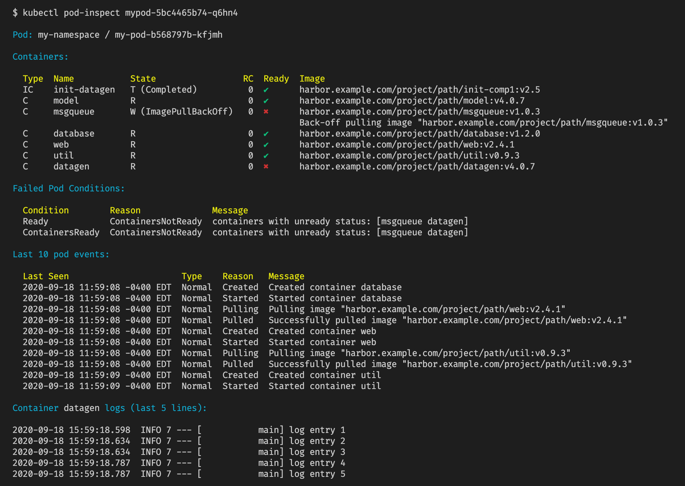

# kubectl-pod-inspect

When you have a pod composed of multiple containers, it can be tedious to identify which container
is failing.  `kubectl describe` is just too verbose.  I got tired of searching the describe output for errors
to track down the failed container.

`kubectl-pod-inspect` gives you just enough information about the containers to figure out what is going on
quickly:

- a list of all containers and their current status and image
- all pod failure status conditions
- the most recent N pod events (defaults to 10)
- most recent N log lines from any non-ready containers (defaults to 5)

## Example

In this example output, you can see that container `msgqueue` is not running, due to an image pull problem.

Container `datagen` is running, but hasn't completed startup yet.

## Installing

To install, download the appropriate binary from the [release page](https://github.com/jpriebe/kubectl-pod-inspect/releases).  Save it somewhere in your path.

You can also download this repository and install it using Makefile.
